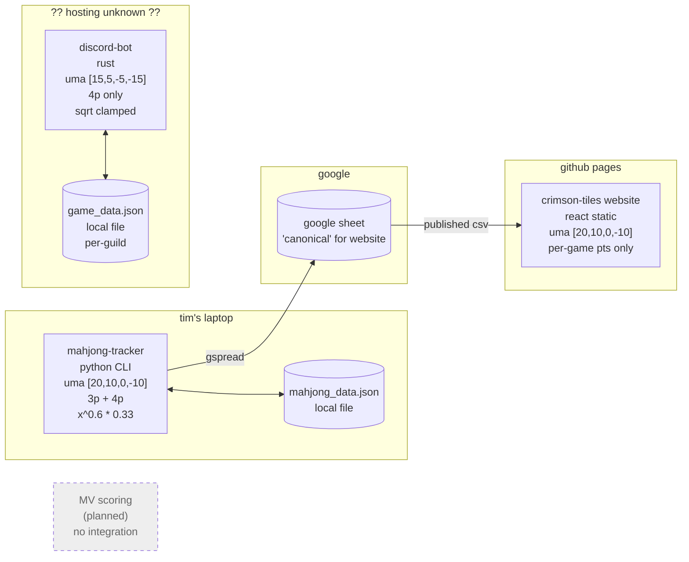
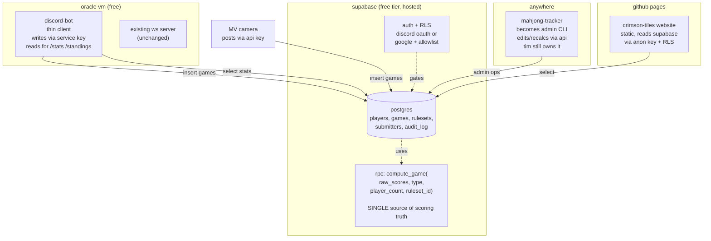
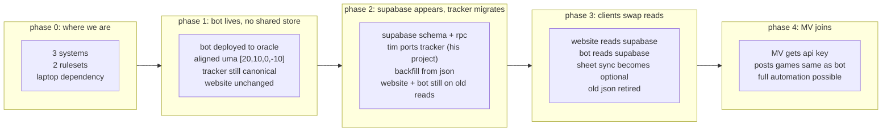

# crimson tiles club software architecture

## what this doc is

a reference for how the club's software fits together, where we are now, where we want to be, and why. living doc, edit as decisions change. lives here in the website repo because it's the most-watched club repo and most contributors will land here first.

audience: officers, current contributors, anyone joining the club's software side.

## current state

three writeable systems, two readable systems, two distinct rulesets in code (tracker and website agree on uma, the bot doesn't), no shared store, no MV story. tim's laptop is the only writer that feeds the website. if it's offline, the leaderboard goes stale.

## the problems we're trying to solve

1. **scoring math drift.** the bot uses different uma values than the tracker and website. as long as that's true, "elo" means three different things depending on who you ask. anyone tweaking the formula has to remember to change three places.
2. **single-machine dependency.** the only thing that writes to the website's data source is mahjong-tracker, running on tim's personal laptop. the bot's data is its own island.
3. **no story for new writers.** when the MV camera project ships, where does it post games to? today: nowhere.
4. **manual data entry only.** game submissions happen by tim typing into a CLI from the room. fine today, won't scale to remote/online games or non-tim submitters.

## target state

one canonical store, one scoring impl, every other thing is a thin client.

## decisions

### canonical store: supabase (postgres)

**why supabase specifically:**
- free tier handles club volume forever (500mb db, 5gb bandwidth, 50k monthly active users on auth)
- postgres + auto-generated rest api + auth + row-level security, all in one product
- schema migrations are sql files in git, not "open the dashboard and click stuff"
- one officer creates the project once, has owner access. credit card not required for free tier
- if we ever outgrow it (we won't), self-hosted supabase exists and is the same shape

**why not alternatives:**
- google sheets stays the canonical store: keeps the schema-as-shape problem and makes scoring math live in apps script, which is awkward to develop and version. would need an apps-script web app as the "rules engine" anyway, so the savings are smaller than they look
- cloudflare d1 / workers: more dev work for less feature surface. no built-in auth, no postgrest equivalent
- self-hosted on the oracle vm: doable, more ops burden, doesn't buy us much over hosted supabase
- firebase: similar to supabase but vendor-locked harder and the free tier is more generous on supabase for our shape

### scoring math: lives in supabase as an rpc function

one sql/plpgsql function takes raw scores, game type, player count, ruleset id, returns final points and adjusted points. clients send raw, get computed back. no client reimplements the formula.

ruleset is a row in a table, not a constant in code. lets us change uma without a deploy, and history can show what ruleset was active when each game was played.

### hosting

| component | host | who owns it |
|-----------|------|-------------|
| supabase project | supabase cloud | a club officer (treat the account password like the club discord owner password) |
| discord bot | oracle cloud free vm (already running ws server for one of us) | piggyback on existing instance |
| website | github pages | crimson-tiles github org (current setup) |
| MV camera (later) | a raspberry pi at the table | whoever owns the camera project |
| mahjong-tracker | wherever tim wants to run it. it becomes an admin CLI, not load-bearing | tim |

### auth model

- **website:** supabase anon key in client, rls policies gate writes. for game submissions specifically (if/when we add them), require a signed-in user whose discord id is in a `submitters` table. read access is public for leaderboard data
- **discord bot:** uses a supabase service-role key (full db access). lives in the bot's `.env` on the oracle vm, never in git. trust model: anyone with bot host access has db write access, which is the same blast radius the bot already has
- **mahjong-tracker / admin CLI:** same service-role key as the bot, since it's tim doing admin work
- **MV camera:** dedicated api key with `INSERT` on `games` only, no read access to anything sensitive. revokable per device

## phase plan

### phase 1: bot deployment

scope: get the bot real and online, no architectural changes.

- align bot ruleset to match tracker/website (`uma = [20, 10, 0, -10]`, target 30k, etc.)
- deploy to oracle vm under a `riichi-bot` systemd unit, alongside the existing ws server
- back up `game_data.json` to b2/scp/whatever. nightly cron is fine
- add discord-bot link to the projects page on the website
- close out broken/unfinished items in the bot: `game_type_weight` is collected but never applied to elo deltas, `PlayerStats::generate_scorecard` is `todo!()`, `Box::leak` storm in the report renderer

estimate: one evening for deploy, a couple weekends for the bot fixups. independent of phase 2.

### phase 2: supabase + tracker migration

scope: stand up the canonical store and migrate tim's project.

owner: tim. helpers pair on setup but don't drive the implementation. see `MIGRATION.md` in the tracker repo for the playbook.

key dependencies before starting:
- one officer needs to own the supabase project account
- the canonical ruleset is settled (we already have one: `[20, 10, 0, -10]`)
- 3p schema is included from day one (tracker already supports it)

deliverable: tracker writes to supabase. json file is gone. website and bot still read from their old sources during this phase.

### phase 3: clients swap reads

scope: point the bot and website at supabase. remove duplicate scoring code.

- website: replace pub-csv parsing in `lib/leaderboard.ts` and `lib/standings.ts` with supabase-js calls. local recompute on `/standings` goes away (the rpc returned the points already)
- bot: replace local json + scoring logic with supabase calls. delete `riichi_results::calculate_elo_deltas` and friends
- sheet sync from tracker becomes optional. keep it if anyone still wants the sheet view, drop it otherwise

owner: cosmo + joseff (the website and bot owners). tim reviews schema-affecting PRs.

### phase 4: MV joins

scope: when the camera project is ready, give it an api key and a contract.

- contract: `POST` raw scores + game type + player count to a supabase edge function or directly via postgrest insert
- api key with insert-only on `games` and `game_results`
- no migration needed in any other component, that's the point

## system contracts (target state)

what each component is responsible for, what it depends on.

### supabase

owns:
- canonical game and player data
- the scoring math (one plpgsql function)
- auth and access control

depends on:
- supabase cloud uptime (their problem)
- the supabase project owner account being maintained

### mahjong-tracker (admin CLI)

owns:
- bulk operations tim cares about: recalculate-all, edit-player-rename-everywhere, delete-and-replay
- whatever ergonomic CLI features tim wants for managing the data

depends on:
- supabase service-role key
- the api shape staying stable

### discord-bot

owns:
- discord-side game submission via slash commands
- discord-side display: standings, stats, game cards
- discord identity validation (slash command runner = the user)

depends on:
- supabase api
- discord gateway connection (oracle vm)

### crimson-tiles website

owns:
- public-facing club information
- leaderboard and standings display
- (eventually) game submission form, if we decide we want one

depends on:
- supabase anon key + rls policies
- github pages hosting

### MV camera (later)

owns:
- reading point sticks and producing scores
- detecting game-over

depends on:
- supabase api with a scoped insert key

## open questions

things we haven't decided. anyone with an opinion can update this section.

- **does the website need a game submission form at all, given we'll have a discord slash command and tim's CLI?** current lean: not for v1. revisit if non-discord submitters become a real use case.
- **discord-only auth vs google sign-in for any future submission flows.** current lean: discord, but it requires registering an oauth app under the club's discord developer portal which needs club-discord admin.
- **do we keep the google sheet as a downstream view?** zero cost to keep tim's existing gspread sync running while supabase is canonical. some officers might prefer the spreadsheet view for ad-hoc querying. current lean: keep until someone notices it's outdated.
- **what happens to ELO history when the formula changes?** if we tweak `dampening_power` or `final_multiplier`, do we recompute all historical games or freeze old elo? current lean: keep historical results as recorded with the ruleset id active at the time, and only future games use the new ruleset. simpler, less revisionism.
- **how do we handle player name changes?** today the tracker rewrites every game record. with normalized supabase tables, names live on `players` and game results join through. one column update.
